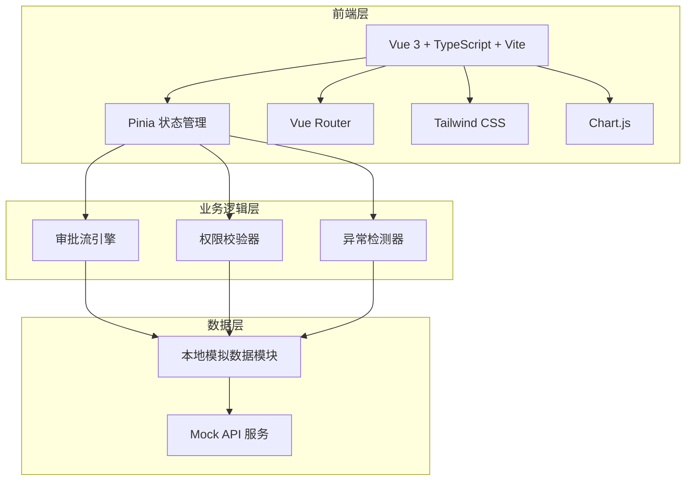
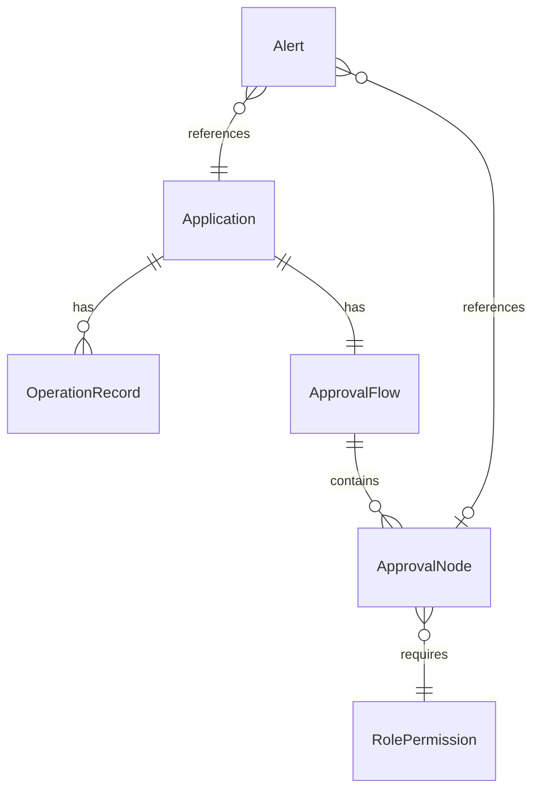

## 1. 架构设计



## 2. 技术说明

- 前端框架：Vue 3 + TypeScript + Vite
- 初始化工具：vite-init（vue-ts 模板）
- 状态管理：Pinia
- 路由：Vue Router 4
- 样式：Tailwind CSS 3
- 图表：Chart.js 4 + chartjs-adapter-date-fns
- 图标：lucide-vue-next
- 后端：无（纯前端 + 本地模拟数据）
- 数据库：无（使用 TypeScript 类型定义 + JSON 模拟数据）

## 3. 路由定义

| 路由 | 用途 |
|------|------|
| / | 工作台主页：统计概览、异常提醒、申请列表、统计图表 |
| /application/:id | 申请详情页：审批流节点、角色权限、操作记录、审批操作 |

## 4. API 定义（模拟）

### 4.1 数据类型

```typescript
interface Application {
  id: string
  title: string
  type: 'leave' | 'expense' | 'purchase' | 'overtime' | 'transfer'
  status: 'pending' | 'approved' | 'rejected' | 'cancelled' | 'processing'
  applicant: { id: string; name: string; department: string; role: string }
  department: string
  amount?: number
  createdAt: string
  updatedAt: string
  flowId: string
}

interface ApprovalFlow {
  id: string
  applicationId: string
  nodes: ApprovalNode[]
}

interface ApprovalNode {
  id: string
  order: number
  name: string
  type: 'submit' | 'department_approve' | 'finance_approve' | 'admin_approve' | 'complete'
  status: 'pending' | 'current' | 'approved' | 'rejected' | 'skipped'
  requiredRoles: string[]
  assignee?: { id: string; name: string; role: string }
  operatedAt?: string
  remark?: string
}

interface RolePermission {
  roleId: string
  roleName: string
  permissions: string[]
  canApprove: boolean
  canReject: boolean
  canTransfer: boolean
}

interface OperationRecord {
  id: string
  applicationId: string
  nodeId: string
  operator: { id: string; name: string; role: string }
  action: 'approve' | 'reject' | 'transfer' | 'submit' | 'withdraw' | 'add_approver'
  remark: string
  operatedAt: string
}

interface Alert {
  id: string
  type: 'over_permission' | 'missing_approver' | 'empty_record' | 'timeout' | 'conflict'
  severity: 'critical' | 'warning' | 'info'
  message: string
  applicationId: string
  nodeId?: string
  createdAt: string
  dismissed: boolean
}
```

### 4.2 模拟 API 列表

| 方法 | 路径 | 说明 |
|------|------|------|
| GET | /api/applications | 获取申请列表，支持 ?status=&type=&department=&q= 筛选 |
| GET | /api/applications/:id | 获取申请详情 |
| GET | /api/applications/:id/flow | 获取审批流及节点 |
| GET | /api/applications/:id/records | 获取操作记录，支持 ?nodeId= 筛选 |
| GET | /api/applications/:id/permissions | 获取当前节点的角色权限 |
| POST | /api/applications/:id/approve | 审批通过 |
| POST | /api/applications/:id/reject | 审批驳回 |
| POST | /api/applications/:id/transfer | 转办 |
| GET | /api/alerts | 获取异常提醒列表 |
| GET | /api/stats | 获取统计数据 |

## 5. 数据模型

### 5.1 数据模型定义



### 5.2 模拟数据设计

- 申请数据：20+ 条，覆盖所有类型和状态组合
- 审批流：每条申请 3-5 个节点，含正常流转、驳回、跳过等场景
- 异常数据：故意构造越权操作记录、缺失审批人节点、空记录申请
- 角色数据：4 种角色，每种角色有明确的权限边界
- 统计数据：近 30 天的审批趋势、类型分布、部门效率

## 6. 关键交互逻辑

### 6.1 三方联动

点击申请 → 加载审批流 → 默认选中当前节点 → 联动加载角色权限和操作记录
切换节点 → 更新角色权限面板 → 筛选该节点操作记录

### 6.2 异常检测规则

| 异常类型 | 检测规则 | 反馈方式 |
|----------|----------|----------|
| 越权操作 | 当前用户角色不在节点 requiredRoles 中 | 操作按钮禁用 + 红色越权警告横幅 |
| 缺审批人 | 节点 assignee 为空 | 节点黄色虚线边框 + "无审批人" 标签 |
| 记录为空 | 该节点无操作记录 | 空状态插图 + "暂无操作记录" 警告文案 |
| 审批超时 | 节点状态为 current 且超过 48 小时 | 超时标签 + 异常提醒横幅 |
| 权限冲突 | 同一节点多个角色可审批但权限范围不同 | 橙色冲突标签 + 详情提示 |
